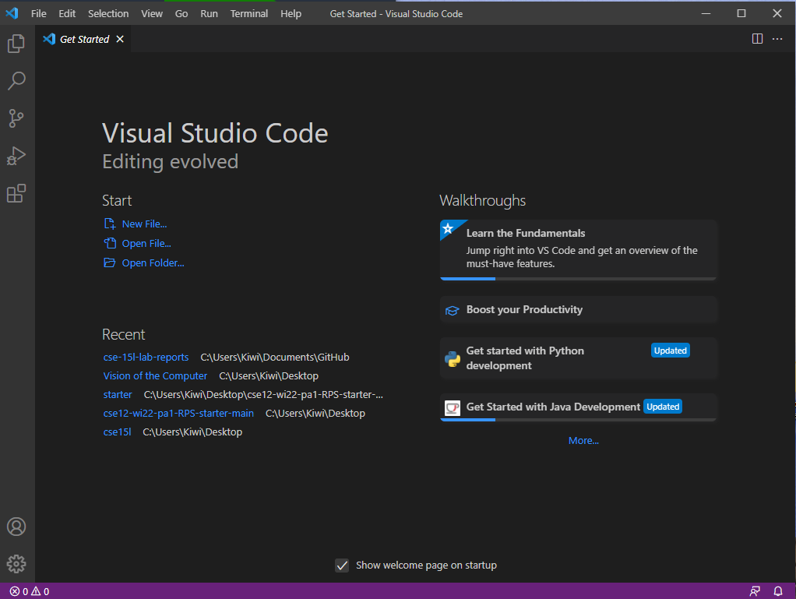
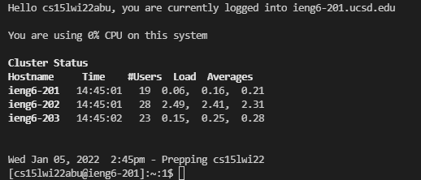
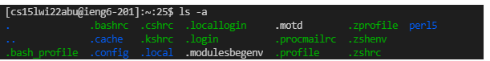
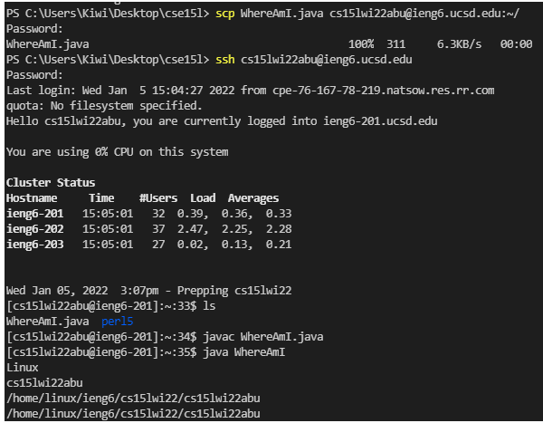
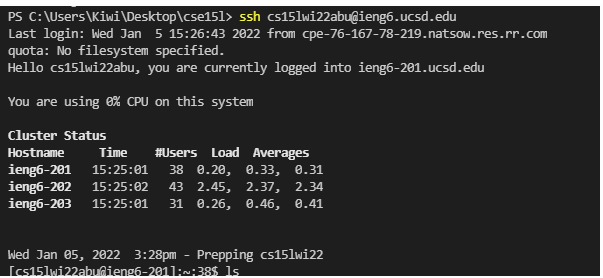
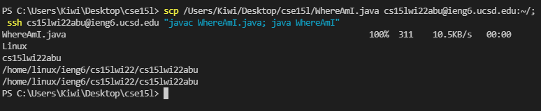

[Home](https://obarquinho.github.io/cse-15l-lab-reports/)
## Installing VScode
Download [VScode](https://code.visualstudio.com/), follow the instructions given by the installer, and you should be greeted to a screen similar to this when VScode has finished installing. 

## Remotely Connecting
If your OS is Windows, you need to [install OpenSSH](https://docs.microsoft.com/en-us/windows-server/administration/openssh/openssh_install_firstuse)</br>
Getting the course-specific account for CSE15l can be found [here](https://sdacs.ucsd.edu/~icc/index.php)</br>
Using VSCode, I 
connected to a remote computer using its remote option. In my terminal, I used the following command, but instead of the `zz`, it is replaced with the characters specific to my account
```
$ ssh cs15lwi22zz@ieng6.ucsd.edu
```
Since this was the first time connecting to the server, I got a message looking like 
```
The authenticity of host 'ieng6.ucsd.edu (128.54.70.227)' can't be established.
RSA key fingerprint is SHA256:ksruYwhnYH+sySHnHAtLUHngrPEyZTDl/1x99wUQcec.
Are you sure you want to continue connecting (yes/no/[fingerprint])?
```
The professor says to type `yes` so I entered that, then my password, and once logged in it looked like


## Run Some Commands
For this portion, I went through the specific commands given by this part of the lab like, `cd` , `ls -a`, and `cat /home/linux/ieng6/cs15lwi22/public/hello.txt`. The screenshot I took for the lab report was of what was returned when I entered `ls -a`

This returned all entries without ignoring those with a `.` listing. I then used Ctrl-D to exit the remote server. 
## Moving Files with `scp`
The `scp` command will copy a file from the client to the server, thus we tested out this feature by creating a file called `WhereAmI.java`, then transferred it to the remote computer using the command
```
scp WhereAmI.java cs15lwi22zz@ieng6,ucsd.edu:~/
```

The image showed that the commands `ls`, `javac WhereAmI.java`, and `java WhereAmI`, were run on the server after entering a password to connect to the server from the `scp` command.
## Setting an SSH Key
An `ssh` key allowed for streamlining entering the server by removing the need for a password for most steps. Entering `ssh-keygen`, and following the extra steps [here](https://docs.microsoft.com/en-us/windows-server/administration/openssh/openssh_keymanagement#user-key-generation), allowed for the set up of the `ssh` key, and allowed for me to use `ssh` and `scp` without entering my password, as seen

## Optimizing Remote Running
We settled on streamlining to a command seen

First, you use `scp` to copy a selected file with its directory path to the remote server, then `ssh` into the server, which was separated from the original command with a `;`. In this `ssh` command, inlude wrapped by `"`, the `javac` command to compile the file in the remote server, then use a `;` to seperate the next `java` command to run the file in the remote server. 
