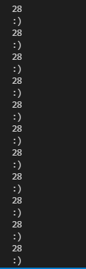

## Preface
My answers will not be in the proper format that the lab assignment asked for.
There are no exact descriptions of the *failure inducing inputs* in my commits
as mentioned in the prompt. I will try to fully explain any discrepencies of my commits and screenshots in relation to what was required by the prompt by giving the same level of detail commanded by the prompt. 
 
Additionally, in my tests, I renamed the tests provided by Joe Politz in the
format of 
 
joetest*N*.md
 
Where *N* is any natural number in the range of 1-8
## First Error
 
[test-file7.md/joetest7.md](https://github.com/Obarquinho/markdown-parse/blob/main/joetest7.md) 
 
