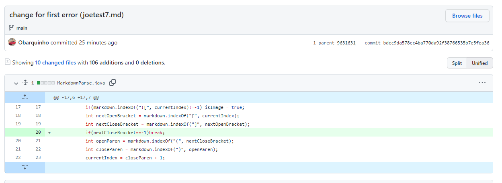
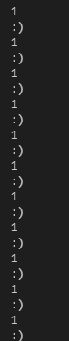

[Home](https://obarquinho.github.io/cse-15l-lab-reports/)
## Preface
My answers will not be in the proper format that the lab assignment asked for.
There are no exact descriptions of the *failure inducing inputs* in my commits
as mentioned in the prompt. I will try to fully explain any discrepencies of my commits and screenshots in relation to what was required by the prompt by giving the same level of detail commanded by the prompt. 
<br/>
Additionally, in my tests, I renamed the tests provided by Joe Politz in the
format of 
<br/>
joetest*N*.md
<br/>
Where *N* is any natural number in the range of 1-8
## First Error
<br/>
[test-file7.md/joetest7.md](https://github.com/Obarquinho/markdown-parse/blob/main/joetest7.md)<br/>
<br/>
Context: This is supposed to be the I/O in the terminal, except I could only
get to output due to it being an infinite loop<br/>
In this case, the bug is due to not accounting for the failure inducing input, 
which can be described as not following the format of a markdown representation
of a link, but also containing characters in it, but not all character, and in 
the case of my code, a `)`. This would then cause an infinite loop due to the
code of ```currentIndex = closeParen + 1;```<br/>
due to there being no `)`, closeParen would be -1, thus resetting the
currentIndex to 1, and repeating the loop. You can see this with the symptom of 
`1` constantly being printed due to the code of ``` System.out.println(currentIndex);```<br/>
Which prints out currentIndex at the end of each loop, thus showing it being in
an infinite loop. 

## Second Error
<br/>
[test-file8.md/joetest8.md](https://github.com/Obarquinho/markdown-parse/blob/main/joetest8.md)<br/>
<br/>
The bug is due to not accounting for the failure inducing input of if there was actually any text inbetween `[`
and `]`, which is needed to actually output a link for a markdown file. Thus 
any value in the parenthesis should not be considered a link, however, my code
still considered it a link, and outputted the symptom of <br/>`a link on the first line`<br/>

## Third Error
<br/>
[test-file5.md/joetest5.md](https://github.com/Obarquinho/markdown-parse/blob/main/joetest5.md)<br/>
<br/>
The bug is due to not accounting for the failure inducing input of if `]` and `(` were actually right next to each other, which is the requirement for markdown files for the format of a link
Thus, due to this not being accounted for, the symptom was that `page.com` was outputted as a link, when in actuality it was not formatted as a link in `test-file5.md` (the failure inducing input). 
