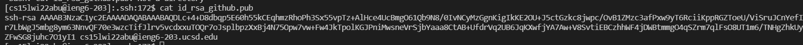

[Home](https://obarquinho.github.io/cse-15l-lab-reports/)
## Setup Github Access from ineg6
This was the option that I chose last week for week 5

## Public Key
 
`Screenshot of public ssh key`

## FIX Public Key location in github profile

