[Home](https://obarquinho.github.io/cse-15l-lab-reports/)<br>
[My markdown-parse repo](https://github.com/Obarquinho/markdown-parse)<br>
[Lab's markdown-parse repo](https://github.com/ucsd-cse15l-w22/markdown-parse)

## Code and Outputs for Tests
` I'm going to put the code for the tests (which are the same for both repos) here and also the output for the junit of both my and the lab repos because their outputs are not specific to just one snippet.`
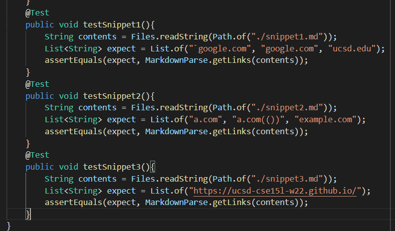<br>
Lab Test junit:
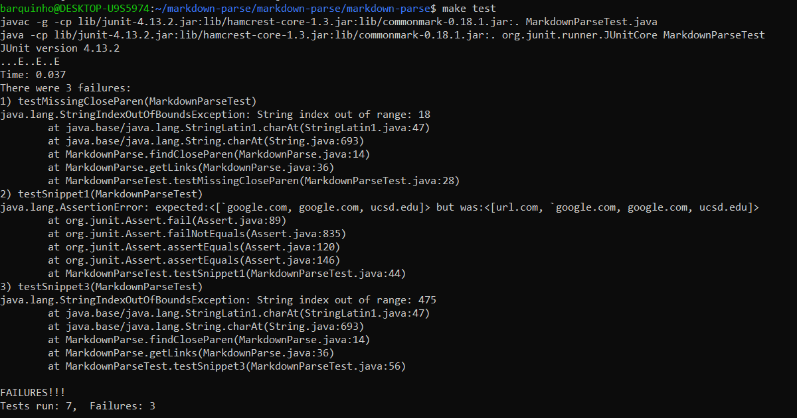<br>
My Test junit:
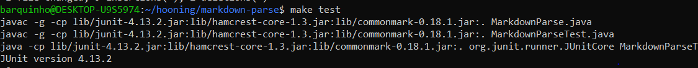
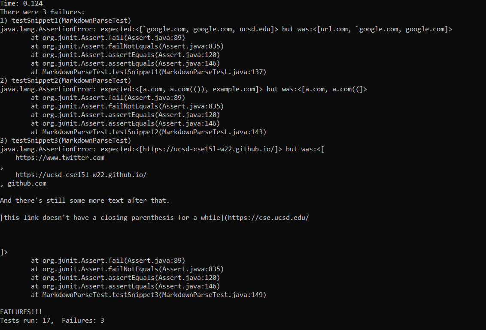

## Snippet 1
` Actual Markdown Display `<br>
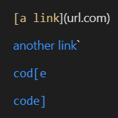<br>
Looking at the markdown display of snippet 1, reveals that the expected links should be:
```"`google.com", "google.com", "ucsd.edu"```<br>
My test failure:
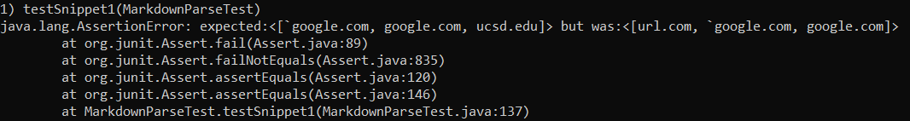<br>
Lab test failure: 
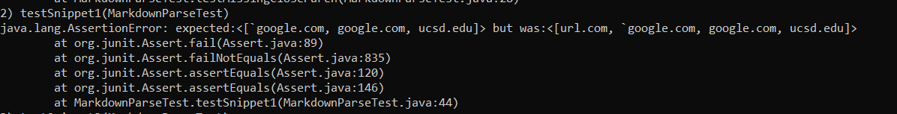<br>
My suggested fix (for my test):<br>
I think the reasons my test failed was because of two reasons: one was not checking for the code marks that would indicate that something is not a link, which can be an easy one line check such as checking for such marks in between our brackets and parenthesis that would mess with the formatting. Another reason was that I did not check for additional `]`, which caused `ucsd.edu` to not be included.

## Snippet 2
` Actual Markdown Display `<br>
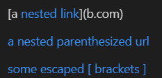<br>
Looking at the markdown display of snippet 1, reveals that the expected links should be:
```"a.com", "a.com(())", "example.com"```<br>
My test failure:
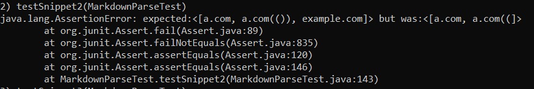<br>
The test for the lab repo did not fail in this instance<br>
My suggested fix (for my test):<br>
I think that there is a simple fix to this because the tests failed only because it did not account for additional brackets and parenthesis that were appropriate to the input. So being able to bring an efficient search for identifying an actual `[]` and `()` combo within the markdown format would be an easy solution to fix this, however, I think that just for close parenthesis, such fix was more than 10 lines for the lab repo.
## Snippet 3
` Actual Markdown Display `<br>
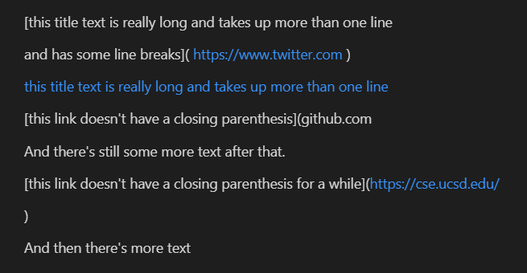<br>
Looking at the markdown display of snippet 1, reveals that the expected links should be:
```"https://ucsd-cse15l-w22.github.io/"```<br>
My test failure:
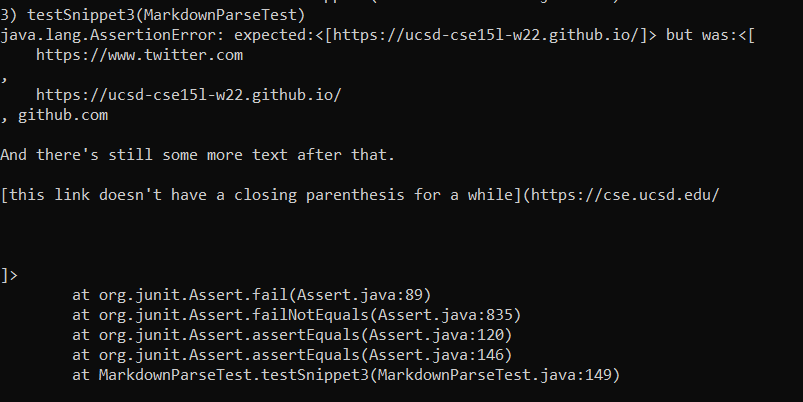<br>
Lab test failure: 
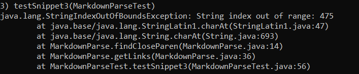<br>
My suggested fix (for my test):<br>
I think that there is an easy fix for this because my markdownparse does not check for spaces inbetween links and parenthesis, which was the source of the problems for my codes output. Therefore, being able to actually check for if there is space between a link and parenthesis would fix this, which is simple to fix such as checking the characters next to the parenthesis to see if they are a space.

