[Home](https://obarquinho.github.io/cse-15l-lab-reports/) 
## General
I found the differences through using `cat` on the `results.txt` file on both repos as demonstrated on the screenshots having a comparison between two terminals. 
My results are on the right and the lab's results are on the left

## 194.md
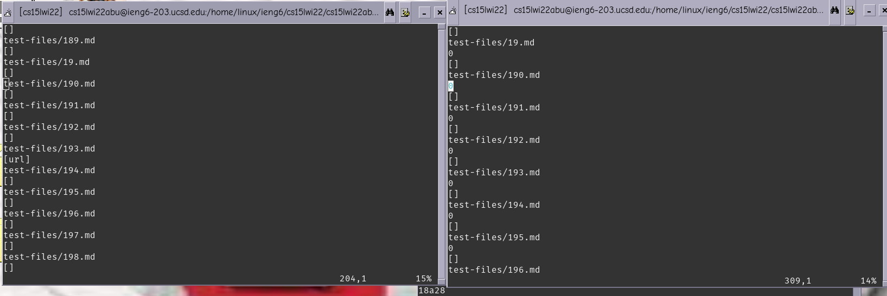 
Here are the different outputs found for 194.md 
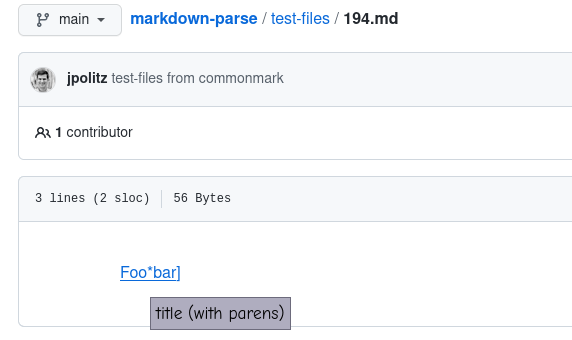 
Here is the expected output. 
Both parsers are wrong, I will analyze the problem with the lab's parser
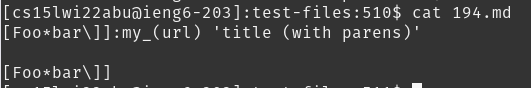
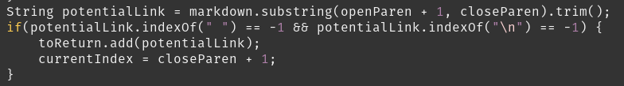 
So the problem with the lab's parser is that it only adds a url to the `toReturn` only if there is something in between parenthesis, however the link is not in parenthesis, but inside singular ticks.

## 201.md
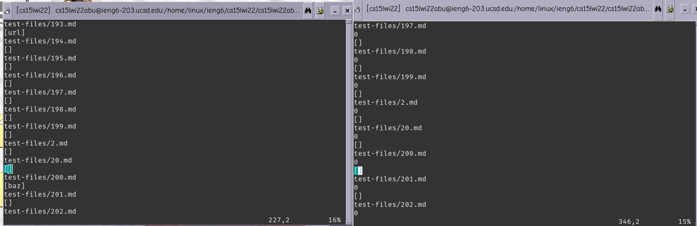 
Here are the different outputs found for 201.md 
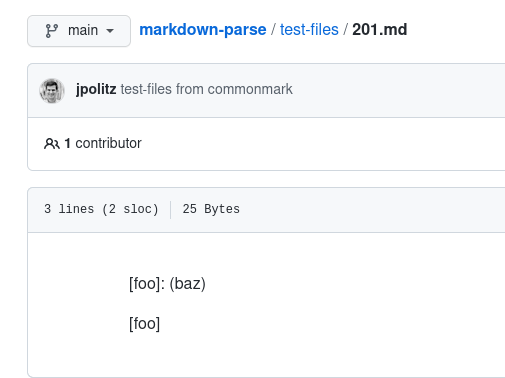 
Here is the expected output. 
The lab's parser is wrong, I will analyze the problem.
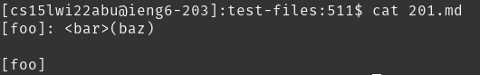 
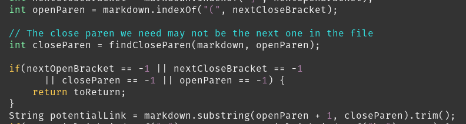 
So the problem is that the lab's parser does not check to see if there is space inbetween the closed bracket and the open parenthesis, of which the space would make it not a link. 

## 22.md
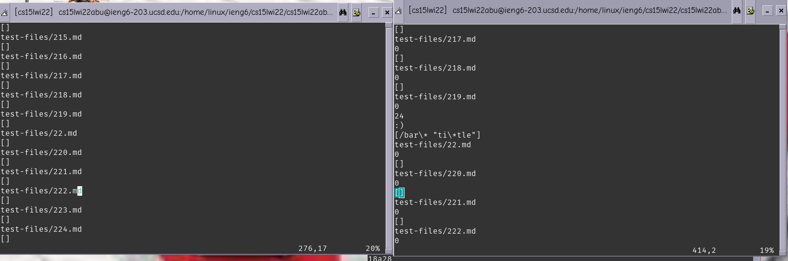 
Here are the different outputs found for 22.md 
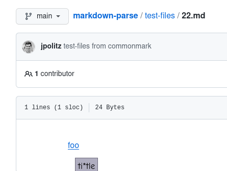 
Here is the expected output. 
Both parsers are wrong and I will be going over the error with my parser.
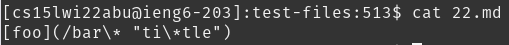 
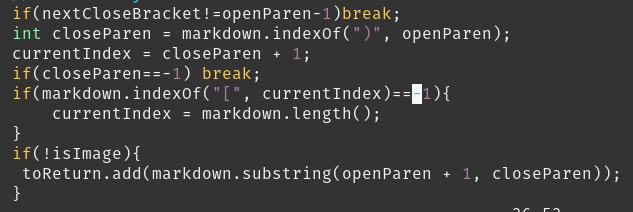 
So the problem with my parser is that it does not properly check for slashes and characters that should be ignored in the url, instead, it just outputs the whole string in between the parenthesis.
